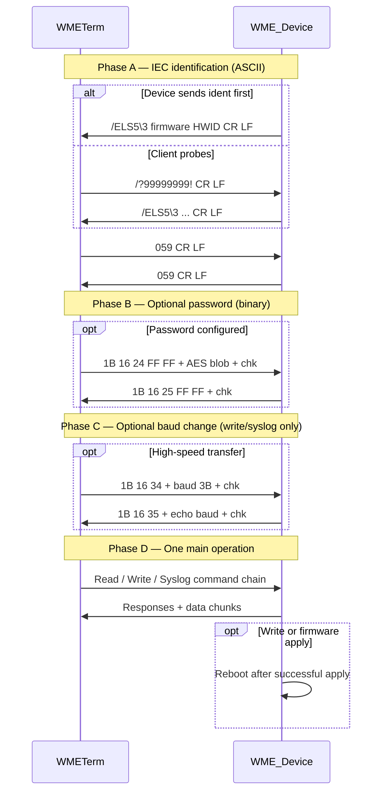
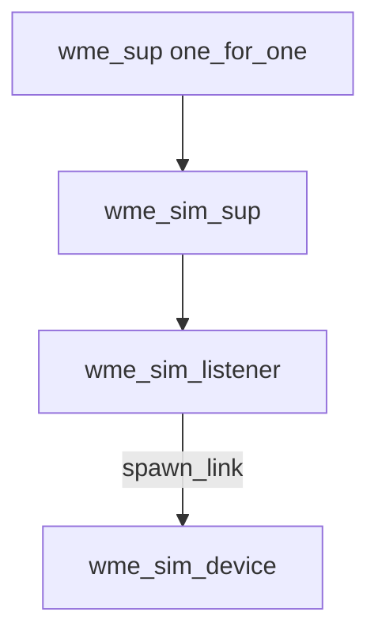

# WM-E Protocol — Erlang/OTP Implementation Plan (Standalone)

## 1. Purpose and scope

### 1.1 What this project delivers

An **OTP library** (`wme` application) with:

- **Client**: TCP/TLS client that talks to WM-E modems — IEC handshake, optional password, config read/write, syslog read/clear
- **Device simulator**: inbound TCP/TLS server that behaves like WM-E firmware for integration tests and benchmarking
- **Benchmark harness**: escript measuring handshake latency and transfer throughput

**Not in scope for v1**: AlarmLink commands (`0x80`–`0x91`), firmware upload (`0x02`), certificate/CRL/CSR lifecycle, password change (`0x26`), contact list (`0x20`), DM-API integration, job queues.

### 1.2 Terminology

| Term | Meaning |
|------|---------|
| WM-ETerm | Terminal / client (our Erlang client or simulator peer) |
| WM-E | Device firmware (modem or AlarmLink unit) |
| IEC commands | ASCII identification phase before binary `1B 16` frames |
| Option byte | 1-byte discriminator selecting read/write category (e.g. `0xFF` = full config) |

### 1.3 Transport

- Local serial or **remote TCP/IP** (typical config port **9998**)
- TLS optional (device may require TLS; ident handshake is identical on cleartext or TLS socket)
- Communication is **not encrypted** at protocol level today (password frame uses AES for the password blob only; bulk data is cleartext)

---

## 2. Complete session flow

Every WM-E session follows this order:



After successful config write or firmware apply the **device reboots**.

---

## 3. Phase A — IEC 62056-21 identification

### 3.1 Wire bytes

| Direction | Bytes (hex) | ASCII |
|-----------|-------------|-------|
| Client probe (optional) | `2F 3F 39 39 39 39 39 39 39 39 21 0D 0A` | `/?99999999!\r\n` |
| Device ident (example) | varies | `/ELS5\3 <firmware> <hw_id>\r\n` |
| Client ack | `06 30 35 39 0D 0A` | `\x06` + `059\r\n` |
| Device ack | `06 30 35 39 0D 0A` | `059\r\n` |

- Request address field is optional; default `99999999` when omitted
- Response includes **firmware version**; extended protocol also returns **hardware ID**
- Some AlarmLink units may **repeat the ident line** before echoing `059` — client must skip duplicate `/…` lines (up to 4 lines) until `059\r\n` is received

### 3.2 Ident line parsing

Format: `/MMMB…<ident>\r\n`

- `MMM` = 3-char manufacturer ID (e.g. `ELS`)
- `B` = baud-rate identification character (byte at index 4 after `/`)
- Remainder = identification string (firmware version, capabilities)

Example: `/ELS5\3 5.3.59.0 118\r\n` → Manufacturer=`ELS`, BaudChar=`5`, Ident=`5\3 5.3.59.0 118`

### 3.3 Protocol version (chunk size)

After handshake, select **V1** or **V2** chunking:

| Version | Chunk size | Read response size | Write packet wire size |
|---------|------------|--------------------|------------------------|
| V1 | 256 bytes (`0x100`) | 262 bytes (`0x106`) = 5 header + 256 data + 1 chk | 262 bytes (`0x106`) |
| V2 | 1024 bytes (`0x400`) | 1030 bytes (`0x406`) | 1030 bytes (`0x406`) |

**Auto-detection**: if ident string contains `1K` or `1024` (case-insensitive) → V2, else V1.

**Important rule**: **config writes always use V1 (256-byte packets)** even when reads or firmware use V2.

---

## 4. Phase B — Password command (optional)

Only sent when device has password protection enabled.

### 4.1 Wire format

| | Bytes |
|---|-------|
| **Request** | `1B 16 24 FF FF` + 16-byte AES-256-CBC ciphertext + 1-byte XOR checksum |
| **Response** | `1B 16 25 FF FF` + 1-byte XOR checksum |

### 4.2 Password rules (plaintext, before encryption)

- Length: **1–16 characters**
- Allowed: English letters `A–Z a–z`, digits `0–9`, special `!`
- Password protection is optional and can be enabled/disabled at runtime or manufacturing

### 4.3 AES encryption (open item)

Spec states AES-256-CBC producing **16 bytes** ciphertext. Key and IV derivation are **not documented** in the protocol PDF. Before implementing `wme_password.erl`:

1. Capture one password exchange with a known password from hardware, **or**
2. Reverse-engineer from legacy `WMEProtocol.pas` / `EncryptPPP` routines

Until resolved, simulator may accept a configurable plaintext password without AES for local testing, and gate production client on confirmed KDF.

---

## 5. Phase C — Baud-rate change (optional)

Used before **write** or **syslog** operations to switch serial/TCP throughput.

| | Layout |
|---|--------|
| **Request** | `1B 16 34` + 3-byte baud value + XOR checksum |
| **Response** | `1B 16 35` + same 3-byte value echoed + XOR checksum |

Implement in simulator; client needs this only if bridging to serial.

---

## 6. Checksum algorithms

### 6.1 XOR checksum (per-frame)

Used on every `1B 16` frame. XOR all bytes from **index 2** (command byte) through the **last payload byte** (everything except the final checksum byte).

**Convention for computing checksum position**:

- `end_index = 0` means "last element of buffer" (send direction)
- `end_index = -1` means "second-to-last" (exclude checksum at end — receive direction)

**Pseudocode**:

```
xor_checksum(Buffer, StartIdx, EndIdx):
    if EndIdx == 0:  EndIdx = len(Buffer) - 1
    if EndIdx < 0:   EndIdx = len(Buffer) - 1 + EndIdx
    result = 0
    for i from StartIdx to EndIdx:
        result = result XOR Buffer[i]
    return result AND 0xFF
```

**Frame validity**: response is a complete WM-E frame only if:

1. First two bytes are `1B 16`, **and**
2. XOR checksum matches (prevents false positives on short buffers like `15 45 31`)

### 6.2 Fletcher-16 (bulk data integrity)

Used over **entire config/syslog blob** (padded). Matches legacy `FletchPas.pas`:

```
fletcher16(Buffer, InitMSB, InitLSB):
    msb = InitMSB
    lsb = InitLSB
    for each byte b in Buffer:
        msb = (msb + b) AND 0xFF
        lsb = (lsb + msb) AND 0xFF
    return (msb << 8) | lsb
```

For **apply** commands, Fletcher is computed over **chunk-padded** payload: pad data length up to multiple of chunk size (256 for config apply) with zero bytes.

### 6.3 Response validation rules

After XOR check:

1. **Command rule**: `response[2] == request[2] + 1` (except special cases below)
2. **Index echo**: for chunk commands `0x04`, `0x44`, `0x70` — bytes at indices 3–4 of response must equal request indices 3–4
3. **NAK**: if `response[0] == 0x14` at frame start → device rejected command
4. **Device error prefix**: `15 45 3x` (ASCII `E` + digit) — 3-byte error, e.g. `15 45 31` = E1 = no syslog entries

---

## 7. Phase D — Read transfer

### 7.1 Read categories (option byte at index 4 of start-read)

| Option (hex) | Category |
|--------------|----------|
| `FF` | Configuration |
| `0B` | Meter config (pulse and/or M-Bus) |
| `04` | CA certificate |
| `06` | Certificate |
| `07` | CRL |
| `08` | CSR (old private key) |
| `09` | CSR (new private key) |
| `0D` | Device status |
| `10` | System syslog (extended) |
| `11` | User syslog (extended) |
| `20` | Contact list (extended; **deferred**) |

**v1 scope**: `FF` (config), `0D` (status), `0B` (meter config).

### 7.2 Step 1 — Start read (`0x67`)

**Request template** (6 bytes + checksum at index 5):

```
1B 16 67 FF <option> <checksum>
```

Checksum XOR over bytes `[2..4]` (cmd + `FF` + option).

**Golden examples** (full frame hex):

| Option | Purpose | Wire hex |
|--------|---------|----------|
| `FF` | Full config | `1b1667ffff67` |
| `06` | Certificate | `1b1667ff069e` |
| `04` | CA cert | `1b1667ff049c` |
| `08` | CSR old key | `1b1667ff0890` |
| `09` | CSR new key | `1b1667ff0991` |

**Response** (10 bytes):

```
1B 16 68 FF FF <size_MSB> <size_LSB> <fletcher_MSB> <fletcher_LSB> <checksum>
```

- **Size** (2 bytes at indices 5–6): `cfg_size = MSB * chunk_size + LSB` where `chunk_size` is 256 (V1) or 1024 (V2)
- **Fletcher** (2 bytes at indices 7–8): Fletcher-16 over complete reassembled payload
- **Packet count**: `packet_count = ceil(cfg_size / chunk_size)`; if `cfg_size > 0` and rounds to 0, use 1

**Golden response example** (real device trace):

```
1B 16 68 FF FF 09 0C 4B E9 CF
```

XOR of bytes `[2..8]` = `0xCF`.

### 7.3 Step 2 — Read packets (`0x70` / `0x71`)

**Request** (per packet index `i`, 0-based):

```
1B 16 70 <i_hi> <i_lo> <checksum>
```

Template: `1B 16 70 00 00 00` with index patched at bytes 3–4.

**Response**:

```
1B 16 71 <i_hi> <i_lo> <256 bytes data> <checksum>
```

- V1 frame length: **262 bytes** (`0x106`)
- Syslog `0x71` frames: **264 bytes** (`0x108`) — 2 extra bytes vs config read; always 256-byte payload regardless of V2 mode
- Response index bytes echo request index (not `index+1`)

**Payload extraction**: append bytes from index 5 through `len-2` (skip trailing zero padding in sparse chunks if needed — copy non-zero span from first data byte to checksum).

### 7.4 Step 3 — Verify

Reassemble all packet payloads; compute Fletcher-16 over full blob; compare to value from `0x68` response.

---

## 8. Phase D — Write transfer

### 8.1 Write categories (option byte)

| Option (hex) | Category |
|--------------|----------|
| `FF` / `12` | Configuration |
| `0B` | Meter config |
| `0E` | Encryption keys |
| `14` | CA certificate |
| `16` | Certificate |
| `17` | CRL |
| `01` | Bootloader |
| `02` | Firmware |
| `04` | Module delta firmware |
| `20` | Contact list (**deferred**) |

**v1 scope**: `FF` / `12` (config write).

### 8.2 Step 1 — Start write (`0x14`)

**Request template** (10 bytes):

```
1B 16 14 FF <option> <size_byte0> <size_byte1> <size_byte2> <pad> <checksum>
```

Size encoding (3 bytes at indices 5–7):

```
size_byte0 = total_bytes / 0x10000
remainder  = total_bytes mod 0x10000
size_byte1 = remainder / chunk_size
size_byte2 = remainder mod chunk_size
```

(`chunk_size` = 256 for config writes.)

**Response** (6 bytes):

```
1B 16 15 FF FF <checksum>
```

### 8.3 Step 2 — Write packets

Two wire sizes:

| Size ID (byte 2) | Payload length | Total frame |
|------------------|----------------|-------------|
| `04` | 256 bytes | 262 (`0x106`) |
| `44` | 1024 bytes | 1030 (`0x406`) |

**Request layout** (256-byte mode):

```
1B 16 04 <index_hi> <index_lo> <256 bytes data> <checksum>
```

Header template: `1B 16 04 00 00` + data + checksum.

**Response** (6 bytes):

```
1B 16 05 <size_id+1 as u16?> ...
```

Per spec: response byte 2 = `request[2] + 1` (i.e. `05` for `04` writes); bytes 3–4 echo packet index from request.

Client must discard stale 6-byte acks on TCP stream before matching the expected response.

### 8.4 Step 3 — Activate write (`0x64` family)

**Config apply template** (9 bytes):

```
1B 16 64 FF <apply_type> <sub_option> <fletcher_MSB> <fletcher_LSB> <checksum>
```

| `apply_type` (byte 4) | Meaning |
|-----------------------|---------|
| `64` | Config / meter / keys / CA / cert / CRL |
| `32` | Bootloader |
| `08` | Firmware |
| `0A` | Module delta firmware |

| `sub_option` (byte 5) | Written object |
|-----------------------|----------------|
| `02` | Configuration |
| `0B` | Meter config |
| `0E` | Encryption keys |
| `04` | CA certificate |
| `06` | Certificate |
| `07` | CRL |

Fletcher-16 over **256-byte-padded** write buffer goes to bytes 6–7.

**Response**: `1B 16 64 FF <sub_option + 1> <checksum>` (6-byte ack) **or** 3-byte `15 45 3x` device error.

Device **reboots** after successful config/firmware apply.

---

## 9. Syslog commands

### 9.1 IDs

| Context | Read ID (`0x50`) | Clear ID (`0x52`) |
|---------|------------------|-------------------|
| System / developer syslog | `0x10` | `0x00` |
| User syslog | `0x11` | `0x01` |

### 9.2 Start read (`0x50` / `0x51`)

**Request** (8 bytes):

```
1B 16 50 FF <read_id> <count_MSB> <count_LSB> <checksum>
```

Template: `1B 16 50 FF 10 00 00 00` (device syslog, read all).

- `count = 0x0000` → read **all** entries on device
- `count > 0` → read at most that many entries (capped by available)

**Checksum example** (device syslog, count=5):

```
XOR(50, FF, 10, 00, 05) = checksum byte
```

**Response** (10 bytes):

```
1B 16 51 FF <read_id> <available_MSB> <available_LSB> <fletcher_MSB> <fletcher_LSB> <checksum>
```

- `available` = number of transport packets / entries on device (implementation uses as packet index bound)
- Fletcher = over complete syslog blob to be read via `0x70/0x71`

**Empty log**: device may respond with `15 45 31` (E1) instead of `0x51` — treat as zero entries.

### 9.3 Read syslog data (`0x70` / `0x71`)

After successful `0x51`, read packets `0, 1, …, available-1` using **same** `0x70/0x71` as config read:

- Always **256-byte payload** per packet
- Frame length **264 bytes** (`0x108`)
- Stop when: Fletcher matches, `15 45 31` received, packet index exceeds `available-1`, or requested entry count satisfied

**Captured syslog `0x71` golden frame** (264 bytes, index `0x0055`):

```
1b167100553c33313e3120323032362d30352d32325430383a32393a35302e3030305a203153315220574d2d4531535f352e332e35392e30203131382030202d20424f4d3220330d0a3c33313e3120323032362d30352d32325430383a32393a35302e3030305a203153315220574d2d4531535f352e332e35392e30203130382031202d20424f4d332c20372c20322c202d312c20302c20300d0a3c33313e3120323032362d30352d32325430383a34392e3030305a203153315220574d2d4531535f352e332e35392e30203131382031202d20424f4d360d0a0000000000000000000000000000000000000000000000000000000000000000000000000000000000002b
```

Payload contains ASCII syslog lines like `<31>1 2026-05-22T08:29:50.000Z …`.

### 9.4 Clear syslog (`0x52` / `0x53`)

**Request** (7 bytes):

```
1B 16 52 FF <clear_id> <pad_MSB> <pad_LSB> <checksum>
```

Template: `1B 16 52 FF 00 00 00 00` (clear device syslog).

**Response** (7 bytes):

```
1B 16 53 FF <clear_id> <checksum>
```

---

## 10. Error handling

| Pattern | Meaning | Client action |
|---------|---------|---------------|
| `14 …` | Modem NAK | `{error, nak}` — non-retryable for apply |
| `15 45 31` | E1 — no syslog entries / end of read | Normal completion for empty syslog |
| `15 45 32` | E2 | Device error (e.g. unknown command) |
| `15` (AlarmLink) | AlarmLink NAK prefix (**deferred**) | Parse `E` + digit code |
| XOR mismatch | Corrupt frame | Retry read or abort |
| `response[2] != request[2]+1` | Wrong step / stale ack | Discard and continue reading (6-byte ack path) |

**AlarmLink error hints** (for future): E1=checksum, E2=unknown cmd, E3=invalid payload, E4=trigger not allowed from TCP, E5=output execution failed.

---

## 11. Firmware/config process notes (device behavior)

- Config stored on SPI flash with **main + backup** areas, **CRC16** protected; corrupted config restored on reboot
- Failed SPI write detected by RAM vs SPI CRC16 mismatch; firmware restores last good config after restart
- Firmware update file encrypted with **AES-256-CBC**; first **128 bytes** are WM signature for integrity (**deferred** — not needed for v1 simulator)
- Password may be changed at runtime via `1B 16 26 FF FF` + old AES + new AES (**deferred**)

---

## 12. Deferred protocol reference (AlarmLink `0x80`–`0x91`)

Documented for future phases; **not implemented in v1**.

| Cmd | Request | Response payload |
|-----|---------|------------------|
| `0x80` | IO mode query | 8 bytes IOxMODE (0=contact no EOL, 1=contact EOL, 2=voltage in, 3=default out, 4=gate out, 5=alarm out) |
| `0x82` | Output triggers | 8 bytes OxTRIG (0=none, 1=CLI, 2=SMS, 3=CLI\|SMS, 4=RING, …) |
| `0x84` | Output state | 8×uint16 OxDEL + 8×OxTRIG |
| `0x86` | Control outputs | 8 bytes (0=off, 1=on, FF=ignore) → ack `0x87` |
| `0x88` | Arm state query | 1 byte (0=DISARMED, 1=ARMED) |
| `0x8A` | Arm control | 1 byte (0=DISARM, 1=ARM) → ack `0x8B` |
| `0x8C` | Input query | 8×state + 8×mode + 8×invert + 8×edge + 8×arm behavior |
| `0x8E` | Bypass query | 8 bytes (0=disabled, 1=enabled) |
| `0x90` | Bypass control | 8 bytes (0=disable, 1=enable, FF=no change) → ack `0x91` |

Fixed response lengths: IOMode=12, Triggers=12, Outputs=30, Arm=6, Inputs=52, Bypass=12, Control acks=6.

---

## 13. Erlang/OTP application design

### 13.1 Repository layout

```
wme/
├── rebar.config
├── apps/wme/
│   ├── src/
│   │   ├── wme_app.erl
│   │   ├── wme_sup.erl
│   │   ├── wme_constants.hrl      % all opcodes/offsets from Section 7–9
│   │   ├── wme_checksum.erl       % xor_checksum/3, fletcher16/3
│   │   ├── wme_codec.erl            % build_frame, parse_frame, validate_response
│   │   ├── wme_types.erl            % #wme_version{}, #wme_session{}
│   │   ├── wme_transport.erl        % gen_tcp | ssl, {active,false}
│   │   ├── wme_framed_reader.erl   % partial TCP → complete frame
│   │   ├── wme_handshake.erl        % IEC + 059
│   │   ├── wme_password.erl         % 0x24 (after KDF resolved)
│   │   ├── wme_client.erl           % public API
│   │   ├── wme_client_session.erl   % gen_statem step runner
│   │   ├── wme_sim_sup.erl
│   │   ├── wme_sim_listener.erl     % ranch acceptor
│   │   ├── wme_sim_device.erl       % gen_statem device FSM
│   │   ├── wme_sim_store.erl        % ETS config/syslog blobs
│   │   └── wme_bench.erl
│   └── test/
│       ├── wme_checksum_SUITE.erl
│       ├── wme_codec_SUITE.erl
│       ├── wme_client_sim_SUITE.erl
│       └── wme_bench_SUITE.erl
```

### 13.2 Supervision



Client sessions: `spawn_monitor` or `temporary` child — one `wme_client_session` per operation chain.

### 13.3 Public API

```erlang
%% wme_client.erl
connect({tcp, TcpOpts}, Host, Port, Opts) -> {ok, Session} | {error, Reason}.
connect({ssl, SslOpts}, Host, Port, Opts) -> {ok, Session} | {error, Reason}.

read_config(Session, #{option => 16#FF}) -> {ok, Binary} | {error, Reason}.
write_config(Session, #{option => 16#FF, data => Binary}) -> ok | {error, Reason}.
read_syslog(Session, #{id => device | user, count => 0..N}) -> {ok, Binary} | {error, Reason}.
clear_syslog(Session, #{id => device | user}) -> ok | {error, Reason}.
close(Session) -> ok.

%% Opts: #{password => binary(), timeout => ms(), version => v1 | v2 | auto}
```

### 13.4 Client session states (`gen_statem`)

| State | Actions |
|-------|---------|
| `connecting` | `gen_tcp:connect` / `ssl:connect` |
| `handshake` | IEC ident + 059; resolve `#wme_version{}` |
| `auth` | optional `0x24` |
| `idle` | await API call |
| `read_start` / `read_chunks` / `read_verify` | Section 7 pipeline |
| `write_start` / `write_chunks` / `write_apply` | Section 8 pipeline |
| `syslog_start` / `syslog_chunks` | Section 9 pipeline |
| `syslog_clear` | Section 9.4 |
| `closed` | socket close |

Internal step runner executes ordered steps (like a pipeline); each step module is pure over `#wme_session{}`.

### 13.5 Device simulator config

```erlang
#{ident => <<"/ELS5\\3 1.2.3 12345\r\n">>,
  password => undefined | <<"secret">>,
  config => #{16#ff => ConfigBlob, 16#0b => MeterBlob},
  syslog => #{device => [EntryBin], user => []},
  chunk_size => 256 | 1024,
  delays => #{handshake_ms => 0, chunk_ms => 0}}
```

Simulator FSM: `await_ident` → `handshake_done` → `framed` (dispatch on byte 2).

### 13.6 Framed reader behavior

When TCP delivers partial data:

1. Strip leading garbage until `1B 16` prefix found
2. Try XOR-valid frame at: `len(buffer)`, then known fixed lengths `{264, 262, 1030, 6}`
3. Do **not** brute-force all lengths 6..N (avoids false checksum matches mid-payload)
4. Per-read timeout + overall frame assembly deadline (default 30s, configurable)
5. Recoverable: `timeout` on partial buffer; abort on `tcp_closed`

---

## 14. Implementation phases

### Phase 1 — Codec (1–2 days)

- `wme_checksum` + `wme_codec` + `wme_framed_reader`
- EUnit tests from **Appendix C** golden vectors
- PropEr: XOR idempotence, Fletcher round-trip

### Phase 2 — Handshake + transport (1 day)

- `wme_transport`, `wme_handshake`
- Device-first ident, client probe, duplicate ident skip, version auto-detect

### Phase 3 — Read/write (2–3 days)

- Full Section 7 + Section 8 pipelines in `wme_client_session`
- Config write always V1 chunks; NAK `0x14` handling

### Phase 4 — Password + syslog (2 days)

- Resolve AES KDF; `wme_password`
- Syslog `0x50`–`0x53` + `0x70/0x71` loop; empty log via `15 45 31`

### Phase 5 — Simulator + CT (2 days)

- `wme_sim_listener` + `wme_sim_device` implementing server side of Sections 3–9
- Integration: read/write round-trip, syslog, wrong password

### Phase 6 — Benchmark (1 day)

- `wme_bench` escript: handshake p50/p99, 64KiB/1MiB config read MB/s, syslog entries/s, N concurrent clients

---

## 15. Design decisions

| Topic | Choice | Rationale |
|-------|--------|-----------|
| Socket mode | `{active, false}` | Explicit framed reads; predictable timeouts |
| State machine | `gen_statem` | Per-step timeouts, call/reply API |
| Acceptor | `ranch` + `ranch_ssl` | Throughput for bench |
| Chunk policy | Auto from ident; override in opts | Matches production clients |
| Errors | `{error, nak}` / `{error, {device_error, Code}}` | Clear non-retryable apply failures |
| Repo | Standalone `wme-erlang` | Library scope, not tied to Go daemon |

---

## 16. Testing strategy

1. **Unit**: Appendix C vectors for XOR, Fletcher, frame parse, IEC line parse
2. **Property**: PropEr on checksums and frame round-trip
3. **Integration**: client ↔ sim (no hardware)
4. **Hardware smoke** (manual): one modem; compare config blob hash with any reference client
5. **Benchmark**: non-gating CI job

---

## 17. Success criteria

- Client reads/writes config against simulator; Fletcher matches
- Syslog read returns entries; clear empties store; empty log handled via `15 45 31`
- Optional password gate on simulator
- Benchmark reports handshake + 1 MiB config read metrics
- No AlarmLink/firmware/cert code in v1

---

## Appendix A — Wire template constants (hex)

```
START_COMM          = 2F3F39393939393939210D0A
HANDSHAKE_PACKET    = 063035390D0A
FRAME_HEADER        = 1B16
START_CONFIG_READ   = 1B1667FFFF00        (chk at [5])
CONFIG_READ_PACKET  = 1B1670000000        (idx [3,4], chk [5])
START_CONFIG_WRITE  = 1B1614FFFF0000000000
CONFIG_WRITE_256    = 1B16040000          (+ 256 data + chk)
CONFIG_WRITE_1K     = 1B16440000
APPLY_CONFIG        = 1B1664FFFF02000000  (Fletcher [6,7], chk [8])
START_SYSLOG_READ   = 1B1650FF10000000
START_SYSLOG_CLEAR  = 1B1652FF00000000
```

## Appendix B — Frame length reference

| Frame type | Length (bytes) | Hex |
|------------|----------------|-----|
| IEC ident / 059 | variable / 6 | — |
| 6-byte ack | 6 | — |
| Start read response | 10 | — |
| Config read `0x71` | 262 | `106` |
| Syslog read `0x71` | 264 | `108` |
| Config write packet | 262 | `106` |
| 1K write packet | 1030 | `406` |
| Start syslog read rsp | 10 | — |
| Clear syslog rsp | 7 | — |

## Appendix C — Golden test vectors

### C.1 XOR checksum

```erlang
%% bytes [0,1,2] XOR range [0,1] = 01 XOR 02 = 03
[{[16#01,16#02,16#03], 0, 1, 16#03}].

%% Real 0x68 response — XOR [2..8] = 0xCF
Resp68 = [16#1B,16#16,16#68,16#FF,16#FF,16#09,16#0C,16#4B,16#E9,16#CF],
xor_checksum(Resp68, 2, -1) =:= 16#CF.

%% Start config read default — XOR [2..4] = 0x67
StartRead = [16#1B,16#16,16#67,16#FF,16#FF,16#00],
xor_checksum(StartRead, 2, 0) =:= 16#67.  %% place at index 5 → 1b1667ffff67
```

### C.2 Frame completeness

```erlang
%% Must NOT accept 6 bytes without 1B16 prefix
Spurious = [16#15,16#45,16#31,16#AA,16#BB, Chk],
is_complete_wme_frame(Spurious) =:= false.

%% Valid 6-byte 0x71 ack
Empty71 = [16#1B,16#16,16#71,16#00,16#49, Chk],
is_complete_wme_frame(Empty71) =:= true.
```

### C.3 Syslog start wire

```erlang
%% Device syslog, count=5: XOR(50,FF,10,00,05)
SyslogStart = [16#1B,16#16,16#50,16#FF,16#10,16#00,16#05, Chk],
xor_checksum(SyslogStart, 2, 0) =:= Chk.

%% Clear user syslog: XOR(52,FF,01)
SyslogClear = [16#1B,16#16,16#52,16#FF,16#01,16#00,16#00, Chk],
xor_checksum(SyslogClear, 2, 0) =:= Chk.
```

### C.4 Fletcher example

```erlang
Data = [16#01,16#02,16#03,16#04],
{MSB, LSB} = fletcher16(Data, 0, 0),
Fletcher = (MSB bsl 8) bor LSB.
%% Use in synthetic 0x51 response at bytes [7,8]
```

### C.5 Size calculation

```erlang
%% cfg_size = MSB * ChunkSize + LSB
%% packet_count = (cfg_size + ChunkSize - 1) div ChunkSize
cfg_size(16#09, 16#0C, 256) -> 9 * 256 + 12 = 2316.
```

## Appendix D — `wme_constants.hrl` excerpt

```erlang
-define(WME_HEADER, <<16#1B, 16#16>>).
-define(WME_NAK, 16#14).
-define(WME_DEVICE_ERR, 16#15).

-define(CMD_START_READ, 16#67).
-define(CMD_READ_HDR,   16#68).
-define(CMD_READ_PKT,   16#70).
-define(CMD_READ_RSP,   16#71).

-define(CMD_START_WRITE, 16#14).
-define(CMD_WRITE_ACK,   16#15).
-define(CMD_WRITE_256,   16#04).
-define(CMD_WRITE_1K,    16#44).
-define(CMD_APPLY_CFG,   16#64).

-define(CMD_PASSWORD_REQ, 16#24).
-define(CMD_PASSWORD_RSP, 16#25).

-define(CMD_SYSLOG_READ,  16#50).
-define(CMD_SYSLOG_HDR,   16#51).
-define(CMD_SYSLOG_CLEAR, 16#52).
-define(CMD_SYSLOG_CLR_ACK, 16#53).

-define(OPT_CONFIG, 16#FF).
-define(OPT_STATUS, 16#0D).
-define(OPT_METER,  16#0B).

-define(CHUNK_V1, 256).
-define(CHUNK_V2, 1024).
-define(FRAME_CONFIG_READ, 262).
-define(FRAME_SYSLOG_READ, 264).
```

